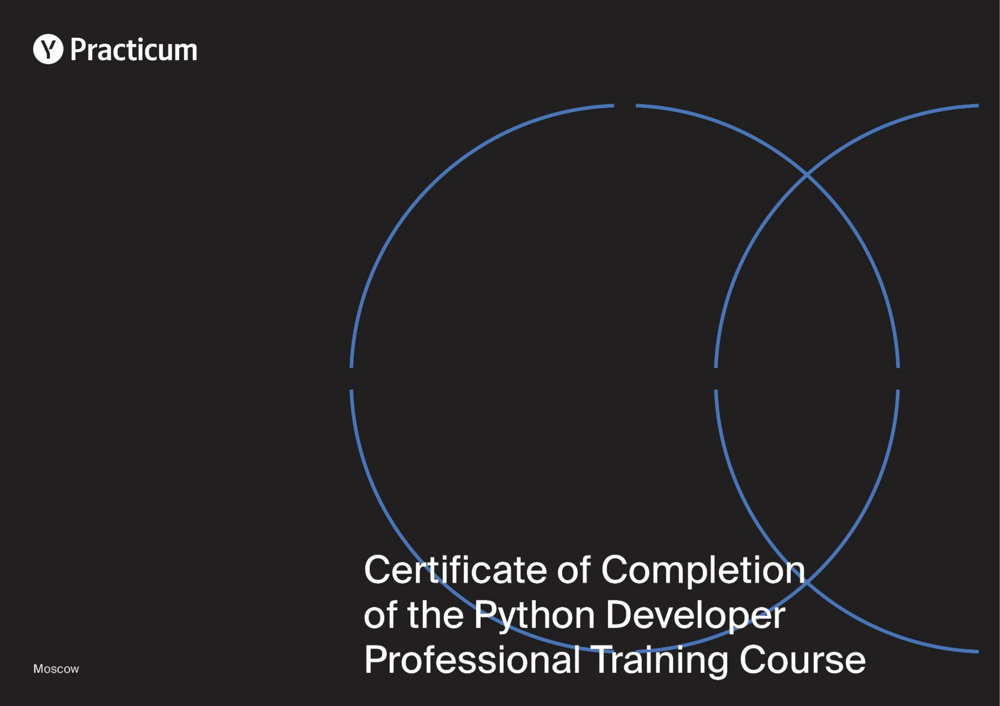
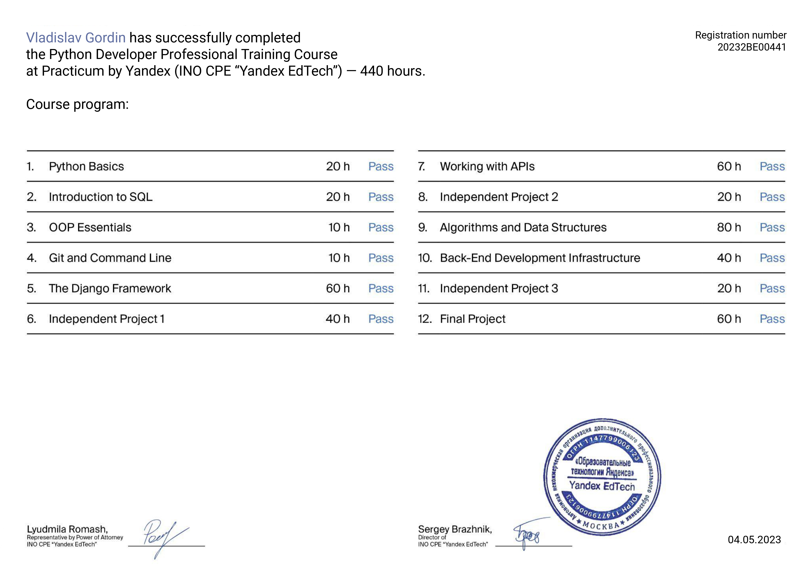
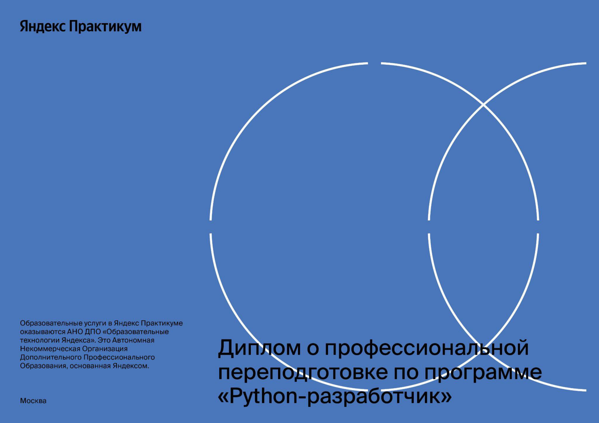
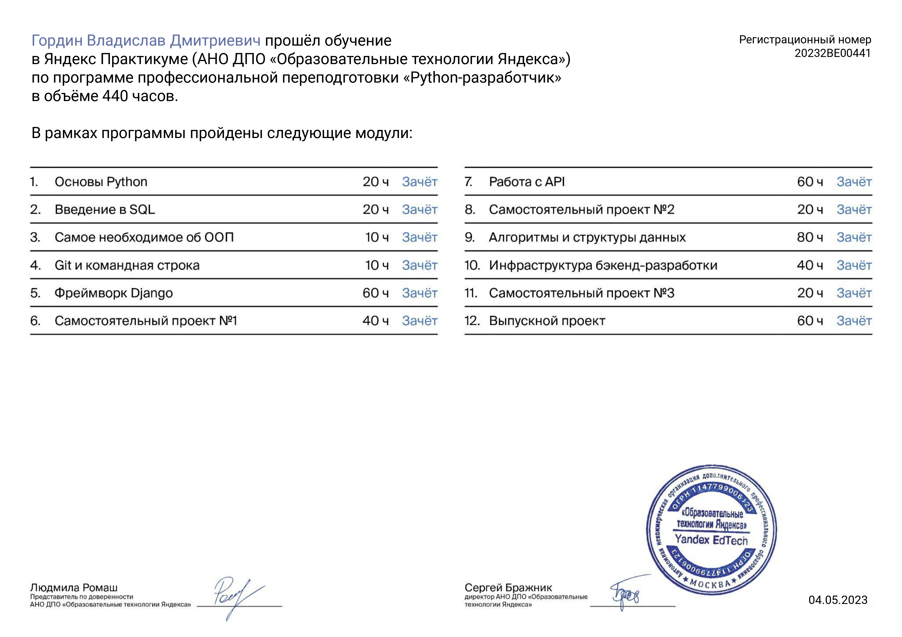
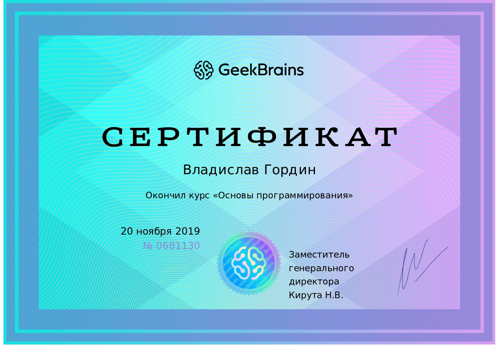
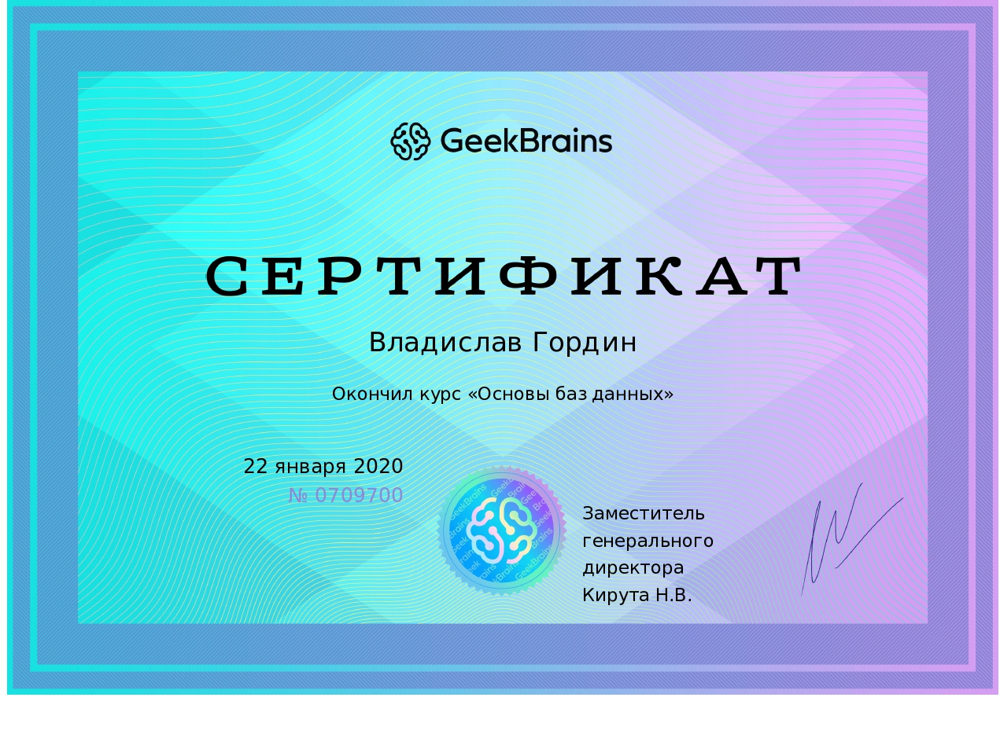
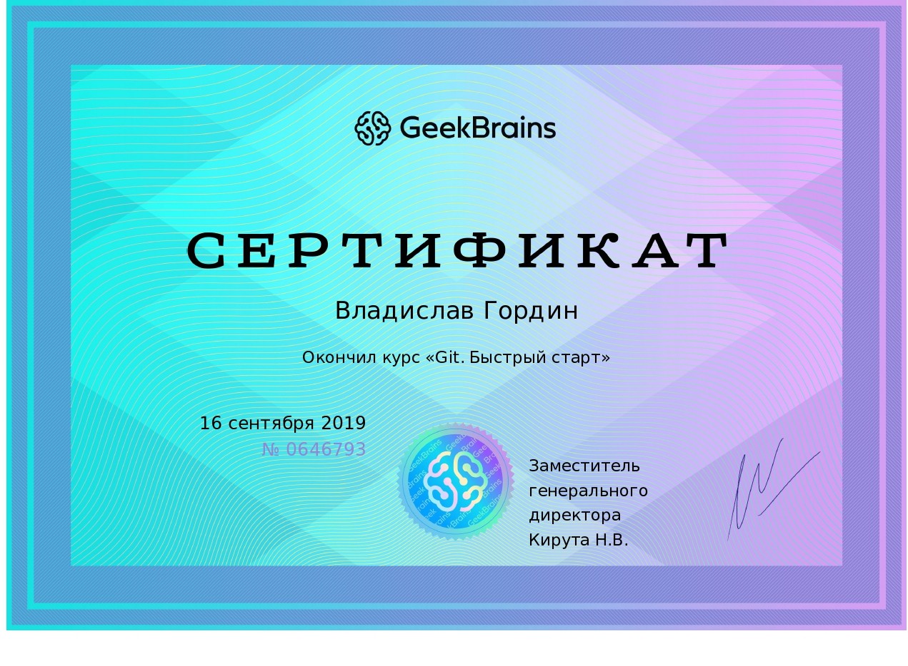
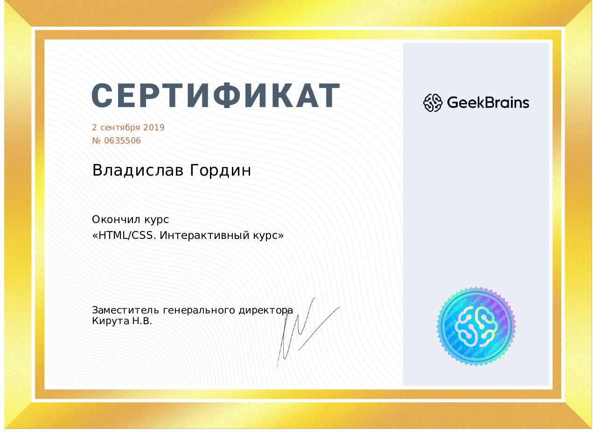
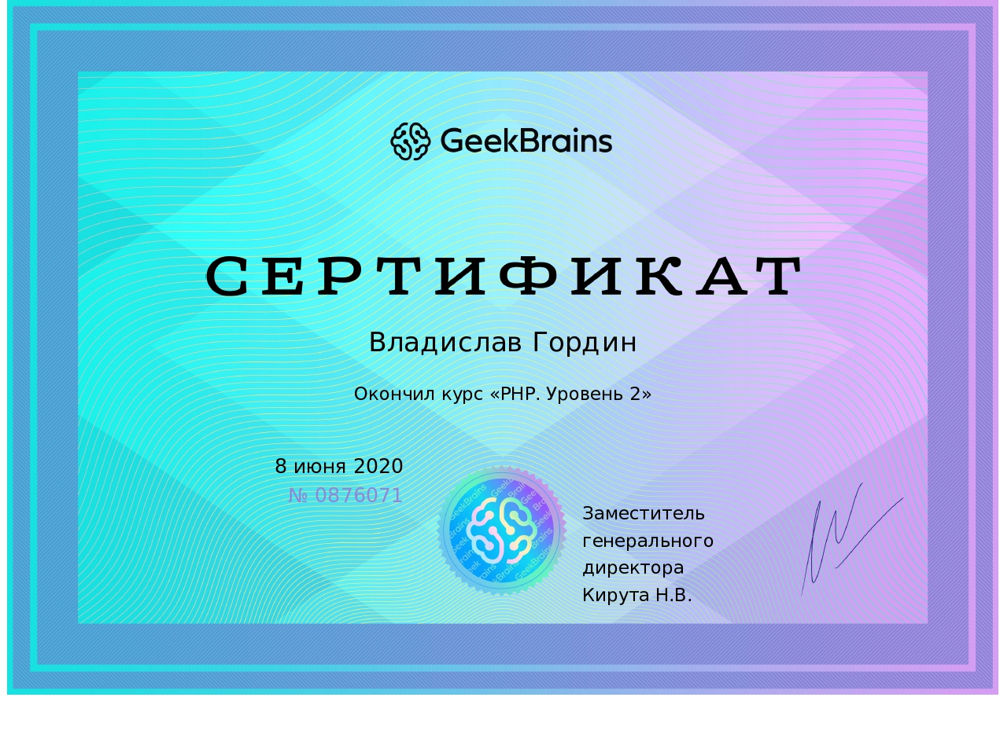
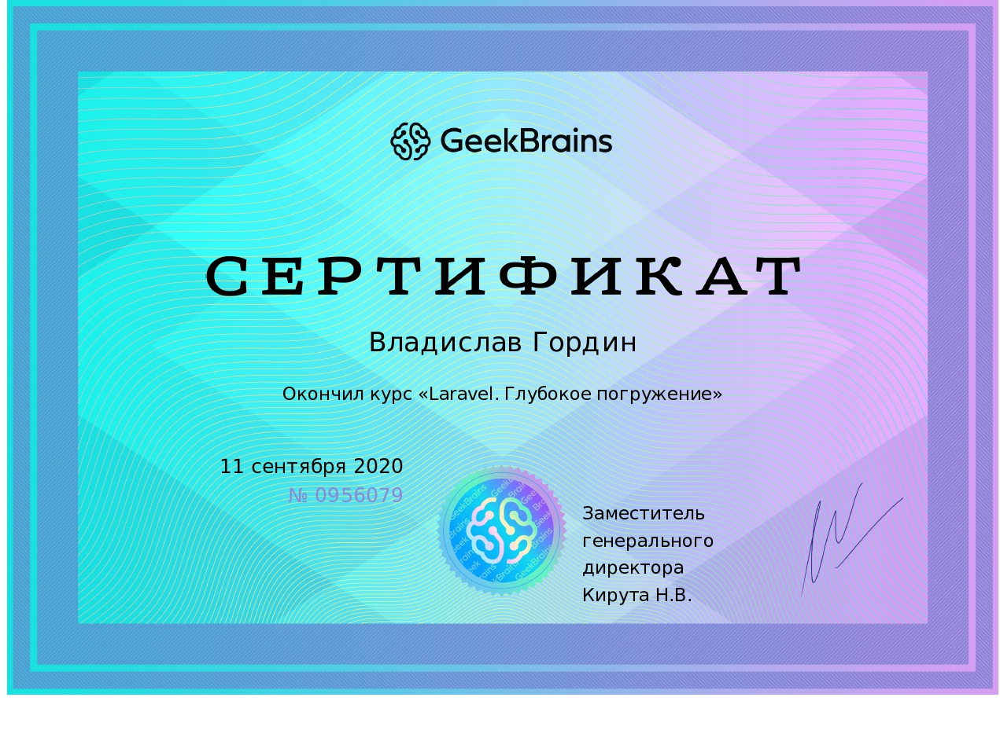

# Привет! | Hey there! 👋

Добро пожаловать на мой профиль GitHub! Меня зовут Владислав, и я увлечен разработкой программного обеспечения, изучением новых технологий и участием в интересных проектах.

Welcome to my GitHub profile! My name is Vladislav and I am passionate about software development, learning new technologies and participating in interesting projects.

<!--
## О себе | About Me

- 🌱 В настоящее время изучаю: **[Технология или Язык программирования]**
- 👯 Ищу сотрудничество в: **[Тип проекта]**
- 💬 Задайте мне вопрос о: **[Темы или технологии, в которых вы разбираетесь]**
- 📫 Как связаться со мной: **[Ваш email или ссылка на LinkedIn]**
- ⚡ Факт обо мне: **[Интересный факт о вас]**
-->

## Мои навыки | My skills

         

<!--
## Мои проекты | My projects

### [Проект 1](https://github.com/username/project1)
Описание проекта. Что он делает, используемые технологии и почему он интересен.

### [Проект 2](https://github.com/username/project2)
Описание проекта. Что он делает, используемые технологии и почему он интересен.
-->

## Статистика GitHub | GitHub Statistics

## Связаться со мной | Contact with me

<table>
  <tr>
    <th colspan="4" style="text-align:center;">Сертификаты | Certificates</th>
  </tr>
  <tr>
    <td></td>
    <td></td>
  </tr>
  <tr>
    <td></td>
    <td></td>
  </tr>
  <tr>
    <td></td>
    <td></td>
  </tr>
  <tr>
    <td></td>
    <td></td>
  </tr>
  <tr>
    <td></td>
    <td></td>
  </tr>
  <tr>
    <td></td>
    <td></td>
  </tr>
  <tr>
    <td></td>
    <td></td>
  </tr>
  <tr>
    <td></td>
    <td></td>
  </tr>
</table>

Спасибо за визит! | Thank you for your visit!
